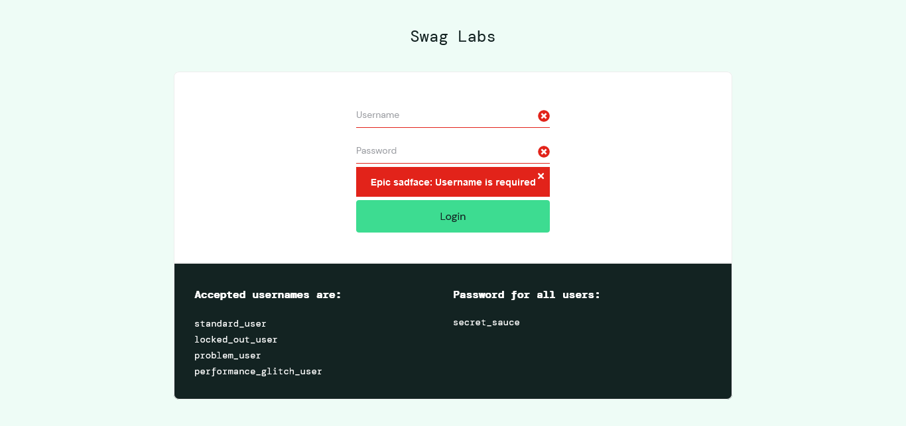
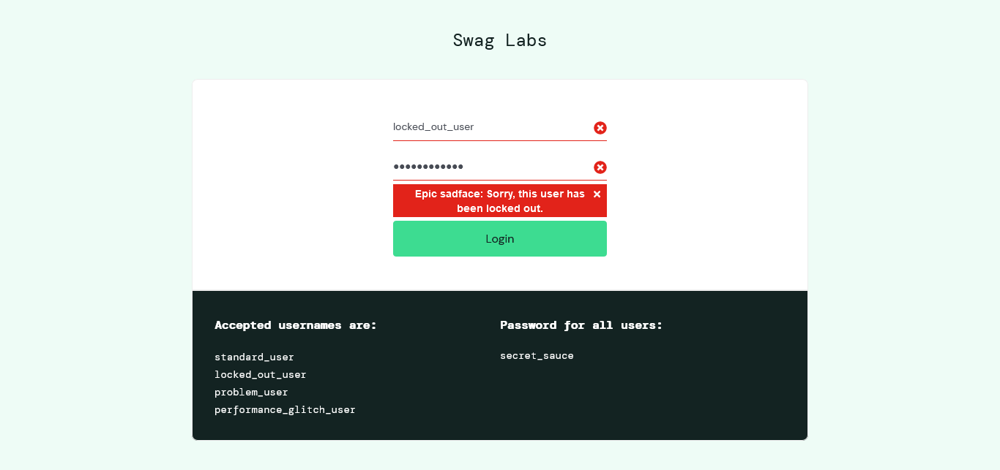
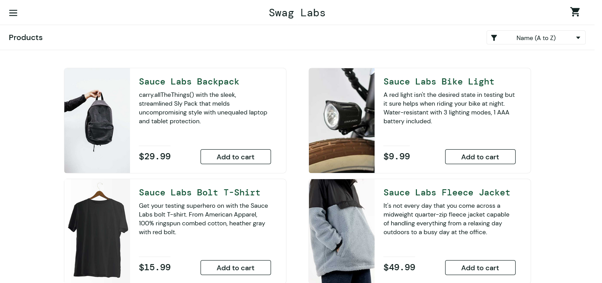
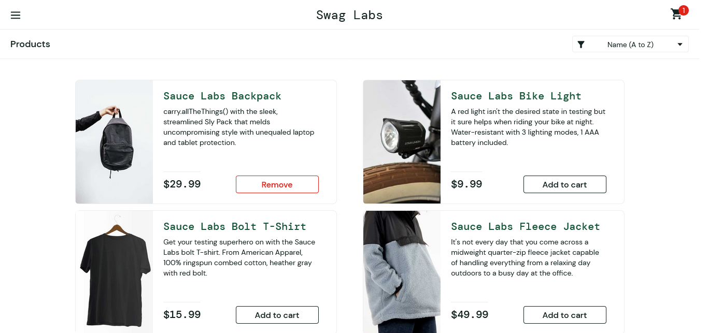

PyTest'te kullanılan yaygın decoratorlar:

@pytest.mark
PyTest'te kullanılan en yaygın decorator olan @pytest.mark sayesinde testlerinizi etiketleyebilir ve filtreleyebilirsiniz.

@pytest.fixture
@pytest.fixture decorator'ı, testlerde kullanılacak ortak kaynaklar için kullanılır. Özellikle, testlerin başlamadan önce 
belirli bir durumu başlatma ve testlerin tamamlanmasından sonra temizleme işlemleri için kullanılır.

@pytest.parametrize
@pytest.parametrize decorator'ı, farklı parametre kombinasyonlarıyla bir testi çalıştırmak istediğinizde kullanılır. 
Bu, testlerinizin farklı girdi değerleriyle nasıl davrandığını kontrol etmek için kullanışlıdır.

## Test Ekran Görüntüleri

1. `test_username_required`:
   

2. `test_login_error_messages`:
   

3. `test_icons_disappear`:
   

4. `test_successful_login`:
   

5. `test_inventory_count`:
   

6. `test_add_item_to_cart`:
   

7. `test_remove_item_from_cart`:
   
